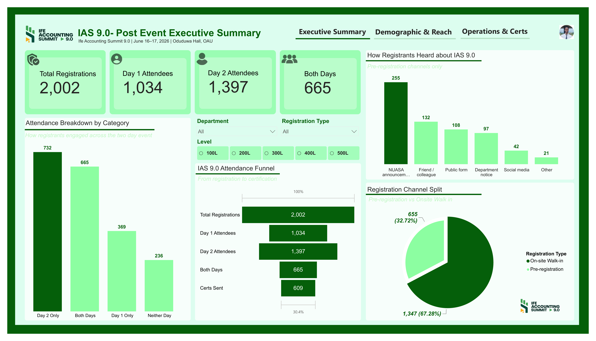
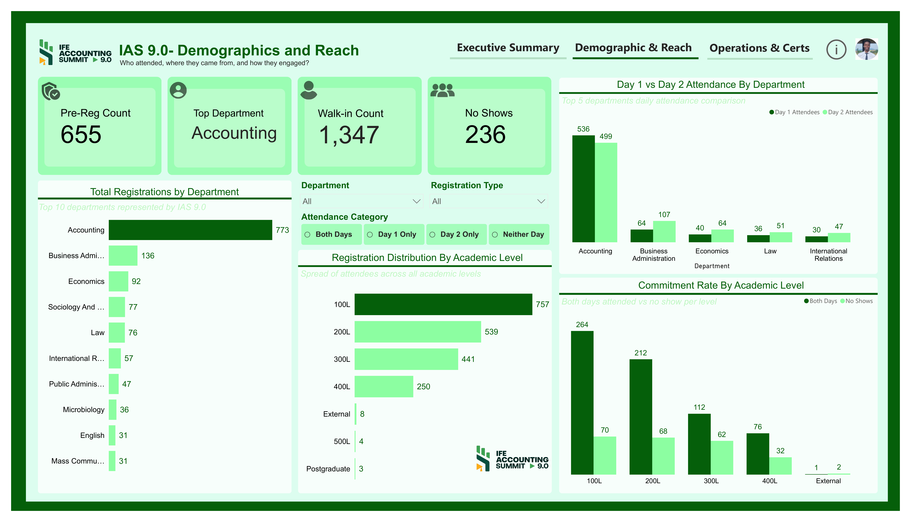
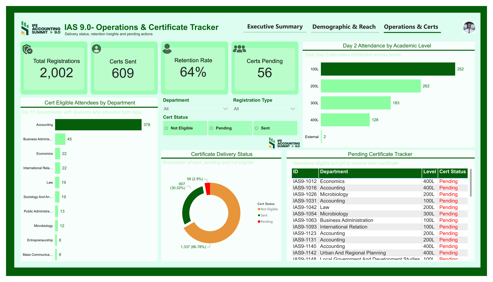

# IAS 9.0 — Post-Event Analytics Dashboard
### Ife Accounting Summit 9.0 | June 16–17, 2026 | Oduduwa Hall, OAU, Ile-Ife
### Prepared by: Fasanya Segun Anuoluwa | Head of Registration Committee, NUASA

---

## 📌 Project Overview

The **Ife Accounting Summit (IAS)** is an annual professional event organised by NUASA (Nigerian University Accounting Students Association) at Obafemi Awolowo University, Ile-Ife. It brings together accounting and finance students, industry professionals and academic leaders for insights, networking and career development.

IAS 9.0, held on June 16–17, 2026 at Oduduwa Hall, OAU, was one of the largest editions in the summit's history — setting new records in total registrations, cross-faculty reach and certificate delivery. This three-page interactive Power BI dashboard was built by the Head of Registration Committee to transform raw registration and attendance data into a complete post-event analytical report that informs planning for IAS 10.0.

**Sponsors:** Meristem, Zedcrest Wealth, Bvndle, Itel Energy, Nairametrics and others.

---

## ❓ The Problem This Dashboard Solves

> *"After IAS 9.0 wrapped, NUASA's leadership needed clear answers to questions the raw registration data alone could not answer. How many people actually attended versus registered? What share came pre-registered versus walking in on the day? Which departments and academic levels showed the most engagement? Which attendees are still owed certificates? And what does all of this tell us about how to run IAS 10.0 better? This dashboard was built to answer every one of those questions — turning 2,002 registration records into a clear post-event intelligence report that the entire organising committee can act on."*

---

## 📊 Dashboard Preview

### Page 1 — Executive Summary


### Page 2 — Demographics & Reach


### Page 3 — Operations & Certificate Tracker


---

## 🔢 Key Numbers at a Glance

| Metric | Value |
|---|---|
| Total Registrations | 2,002 |
| Day 1 Attendees (June 16) | 1,034 |
| Day 2 Attendees (June 17) | 1,397 |
| Both Days (Cert Eligible) | 665 |
| Certificates Sent | 609 |
| Certificates Pending | 56 |
| Retention Rate (Day 1 → Day 2) | 64% |
| Certificate Delivery Rate | 91.6% |
| Walk-in Rate | 67.3% |
| Pre-Registrations | 655 (32.7%) |
| On-site Walk-ins | 1,347 (67.3%) |
| No Shows | 236 |
| Top Department | Accounting (773 registrations) |
| Top Academic Level | 100L (757 registrations) |
| Top Discovery Channel | NUASA Announcement (255) |

---

## 🗂️ Dataset Description

The dataset contains **2,002 attendee records** with the following fields:

| Column | Description |
|---|---|
| Attendee ID | Unique identifier for each registrant (e.g. IAS9-1012) |
| Department | Academic department of the registrant |
| Level | Academic level — 100L, 200L, 300L, 400L, 500L, External, Postgraduate |
| Registration Type | Pre-registration or On-site Walk-in |
| Day 1 Attendance | Whether the registrant attended Day 1 (June 16) |
| Day 2 Attendance | Whether the registrant attended Day 2 (June 17) |
| Attendance Category | Day 1 Only / Day 2 Only / Both Days / Neither Day |
| How Heard | How the registrant discovered IAS 9.0 |
| Cert Status | Not Eligible / Pending / Sent |

---

## 🔍 Insight Questions Each Page Answers

### Page 1 — Executive Summary
1. How many people registered for IAS 9.0 in total and how does that compare across pre-registration and walk-in channels?
2. What was the actual attendance on each day — and why did more people show up on Day 2 than Day 1?
3. How many attendees qualified for certification by attending both days?
4. What does the full registration-to-certification funnel look like from 2,002 registrations down to 609 certificates sent?
5. Which channels were most effective in driving pre-registration awareness?
6. What proportion of registrants were pre-registered versus walked in on the day?

### Page 2 — Demographics & Reach
1. Which department sent the most registrants — and how concentrated is attendance in Accounting versus the rest of the university?
2. How did the top 5 departments compare in Day 1 versus Day 2 attendance — did engagement hold across both days?
3. Which academic level had the highest registration count — and what does that tell NUASA about its core audience?
4. Which academic levels showed the strongest commitment by attending both days versus not showing up at all?
5. Did the summit achieve genuine cross-faculty reach or was it dominated by one department?
6. How did No Shows distribute across academic levels — which levels had the worst follow-through?

### Page 3 — Operations & Certificate Tracker
1. Out of 2,002 registrations, how many attendees are eligible for certificates and how many have been sent versus are still pending?
2. Which departments have the most cert-eligible attendees — and are certificates being delivered proportionally?
3. Which specific attendees are still awaiting their certificate and what are their IDs, departments and levels?
4. How did Day 2 attendance distribute across academic levels — which level drove the highest Day 2 count?
5. What is the overall retention rate from Day 1 to Day 2 — and what does a 64% retention rate say about attendee satisfaction?
6. Is the 91.6% certificate delivery rate acceptable — and what is the plan for the remaining 56 pending certificates?

---

## 💡 Key Findings

### Finding 1 - IAS 9.0 Set a Registration Record
2,002 total registrations makes IAS 9.0 one of the largest editions in the summit's history. The event generated genuine campus-wide interest — with registrants spanning over 30 departments across the university. This growth demonstrates significant brand awareness improvement over previous editions.

### Finding 2 - Walk-in Culture Dominates at 67.3%
Only 655 people (32.7%) pre-registered before the event. The remaining 1,347 (67.3%) registered on-site on event day. While this demonstrates strong ground-level buzz and spontaneous interest, it creates significant operational pressure at registration desks and limits the organising committee's ability to plan capacity, seating and materials in advance.

### Finding 3 - Day 2 Outperformed Day 1 in Attendance
Despite 1,034 people attending Day 1, attendance actually grew to 1,397 on Day 2 - a 35.1% increase. This counter-intuitive pattern suggests that positive word-of-mouth from Day 1 drove additional attendees to show up on Day 2, including people who had registered but did not attend Day 1. This is a strong signal of content quality and on-the-ground buzz.

### Finding 4 - 64% Retention Rate is Excellent for a Two-Day Student Event
Of the 1,034 Day 1 attendees, 665 returned for Day 2 - a retention rate of 64.2%. For a two-day student event with no enforced attendance requirement, this is an excellent result. It confirms that attendees found enough value in Day 1 to commit to returning for Day 2.

### Finding 5 - Accounting Department Registered 773 People But Non-Accounting Students Dominated Overall Attendance
Accounting registered 773 people — the most of any department. However, the remaining 30+ departments combined represented 57.5% of total attendance across both days. This cross-faculty reach is a significant achievement but also reveals a counterintuitive gap — the department the event is most associated with had a lower proportional turnout rate than non-accounting departments, suggesting an engagement problem among Accounting students themselves.

### Finding 6 - 100L Students Are the Most Engaged Segment
First-year students (100L) led every metric: 757 registrations (the most of any level), 352 Day 2 attendees and 264 both-day attendees. This makes 100L students the single most engaged cohort at IAS 9.0. Capturing and retaining this audience from Year 1 creates a pipeline of loyal attendees who can attend IAS for up to five editions during their academic journey.

### Finding 7 - NUASA Announcements and Peer Referrals Are the Most Effective Awareness Channels
Of the 655 pre-registrations, 255 (38.9%) came through NUASA announcements and 132 (20.2%) through friend or colleague referrals. These two channels together drove 59.1% of all pre-registrations - outperforming social media (42), department notices (97) and public forms (108) combined. This confirms that community-driven, peer-to-peer communication is the most powerful discovery mechanism for IAS.

### Finding 8 - Certificate Delivery Reached 91.6% with 56 Still Pending
Of the 665 cert-eligible attendees, 609 have received their certificates (91.6%) and 56 remain pending. The pending tracker on Page 3 shows the exact IDs, departments and levels of outstanding recipients - enabling the committee to complete delivery systematically rather than guessing. Accounting has the most pending cases given its volume.

### Finding 9 - 236 Registrants Were No-Shows
236 people who registered (pre-registration or walk-in) did not attend either day. This 11.8% no-show rate is relatively low but represents real operational waste - especially for pre-registrations where materials may have been prepared. Understanding which levels and departments contribute most to no-shows can help refine communication strategies for IAS 10.0.

### Finding 10 - Social Media Is the Weakest Discovery Channel
Despite being one of the most invested promotional channels for many events, social media drove only 42 pre-registrations - the second-lowest of all channels, above only "Other" (21). This suggests that IAS 9.0's social media presence was either not optimised for conversion or not reaching the right segments of the OAU student population.

---

## ✅ Recommendations for IAS 10.0

### 1. Launch Pre-Registration at Least 3 Weeks Before the Event
Only 32.7% pre-registered. An earlier, more sustained campaign — starting at week one of the semester before IAS 10.0 — would allow the committee to build momentum gradually, reduce registration desk pressure on event day and give logistics planning more reliable attendee numbers to work with.

### 2. Communicate Day 1 Attendance as the Certification Gateway - Loudly and Early
737 people attended Day 2 only and missed cert eligibility because they did not attend Day 1. Many of these attendees may not have understood that attending both days was required for certification. A clear, repeated pre-event communication — through all channels — that Day 1 attendance is mandatory for cert eligibility would meaningfully improve both-day retention.

### 3. Invest Heavily in NUASA Announcements and Peer Ambassador Programmes
NUASA announcements and peer referrals drove 59.1% of all pre-registrations between them. The highest ROI action for IAS 10.0 is to formalise this — creating a structured department-level ambassador programme where NUASA representatives in each faculty drive registrations and awareness through direct peer-to-peer communication, not just social media broadcasts.

### 4. Build a 100L-Focused Onboarding Strategy
First-year students showed the highest engagement at every level. A deliberate strategy to introduce IAS at faculty orientations, first-semester lectures and 100L-specific department groups would cement IAS as a must-attend event from the moment students arrive on campus. A student who attends IAS from 100L can become a five-edition loyalist.

### 5. Investigate and Resolve the Accounting Student Engagement Gap
Accounting is the department most directly associated with IAS, yet non-accounting students collectively outnumbered Accounting students at the event. A post-event survey targeting Accounting students specifically — asking why they did not attend or did not pre-register -would identify whether this is an awareness problem, a scheduling problem, an interest problem or a perception problem. The answer should directly shape IAS 10.0 outreach.

### 6. Complete the 56 Pending Certificate Deliveries Immediately
The pending tracker on Page 3 provides the exact list of IDs, departments and levels. These 56 certificates should be sent before IAS 10.0 planning begins — both as a commitment to attendees who earned them and to protect NUASA's reputation as an organisation that follows through on its promises. A 91.6% delivery rate is good; 100% is the standard to reach.

### 7. Fix the Social Media Strategy Before IAS 10.0
42 pre-registrations from social media is underperformance for what should be a high-reach channel at a university event. This requires either a content strategy overhaul (more targeted, student-facing posts), better platform selection (WhatsApp groups may outperform Instagram for this audience) or integrating a specific social media registration link that is easier to track.

### 8. Plan Infrastructure and Logistics for 3,000+ Registrations
The growth trajectory from previous editions to IAS 9.0's 2,002 registrations suggests IAS 10.0 could exceed 3,000 signups. Registration systems, desk staffing, venue capacity planning, certificate generation workflows and database management must all be scaled accordingly. The current Excel-based approach may need to be upgraded to a dedicated event management platform to handle that volume without errors.

---

## 🛠️ Tools Used

| Tool | Purpose |
|---|---|
| Microsoft Power BI | Three-page interactive dashboard design |
| Power Query | Data cleaning, column standardisation, attendance category creation |
| DAX | All KPIs, calculated measures, funnel logic, cert status filters |
| Microsoft Excel | Raw registration data management |
| Power BI Navigation Buttons | Page-to-page navigation (Executive Summary → Demographics → Operations) |
| Conditional Formatting | Pending certificate highlighting in table |

---

## 🔧 Data Preparation Steps

1. **Attendance Category Column** — Created a calculated column classifying each registrant into Day 1 Only / Day 2 Only / Both Days / Neither Day based on Day 1 and Day 2 attendance flags
2. **Cert Eligibility Logic** — Attendees who attended Both Days = Cert Eligible; all others = Not Eligible
3. **Cert Status Column** — Three values: Not Eligible (1,337 registrants), Sent (609), Pending (56)
4. **Registration Type Standardisation** — Pre-registration and On-site Walk-in values cleaned and standardised in Power Query
5. **Department Trimming** — Removed extra spaces and standardised department name formatting for consistent grouping
6. **Level Ordering** — Created a sort order column (100L=1, 200L=2, 300L=3, 400L=4, 500L=5, External=6, Postgraduate=7) to ensure academic levels display in correct order on charts
7. **How Heard Column** — Cleaned channel names and grouped minor values into "Other" category
8. **No Show Flag** — Registrants with Neither Day attendance = No Show

---

## 📐 DAX Measures

```dax
Total Registrations = COUNTROWS(Registrations)

Day 1 Attendees = 
CALCULATE([Total Registrations], Registrations[Day 1] = "Yes")

Day 2 Attendees = 
CALCULATE([Total Registrations], Registrations[Day 2] = "Yes")

Both Days = 
CALCULATE([Total Registrations], Registrations[Attendance Category] = "Both Days")

Neither Day = 
CALCULATE([Total Registrations], Registrations[Attendance Category] = "Neither Day")

Day 1 Only = 
CALCULATE([Total Registrations], Registrations[Attendance Category] = "Day 1 Only")

Day 2 Only = 
CALCULATE([Total Registrations], Registrations[Attendance Category] = "Day 2 Only")

No Shows = [Neither Day]

Retention Rate = 
DIVIDE([Both Days], [Day 1 Attendees])

Retention Rate % = 
FORMAT([Retention Rate], "0%")

Certs Sent = 
CALCULATE([Total Registrations], Registrations[Cert Status] = "Sent")

Certs Pending = 
CALCULATE([Total Registrations], Registrations[Cert Status] = "Pending")

Cert Eligible = [Both Days]

Not Eligible = 
CALCULATE([Total Registrations], Registrations[Cert Status] = "Not Eligible")

Cert Delivery Rate = 
DIVIDE([Certs Sent], [Cert Eligible])

Pre-Reg Count = 
CALCULATE([Total Registrations], Registrations[Registration Type] = "Pre-registration")

Walk-in Count = 
CALCULATE([Total Registrations], Registrations[Registration Type] = "On-site Walk-in")

Walk-in Rate = 
DIVIDE([Walk-in Count], [Total Registrations])

Pre-Reg Rate = 
DIVIDE([Pre-Reg Count], [Total Registrations])

Top Department = 
MAXX(
    TOPN(1,
        SUMMARIZE(
            Registrations,
            Registrations[Department],
            "Count", COUNTROWS(Registrations)),
        [Count], DESC),
    Registrations[Department])

Commitment Rate by Level = 
DIVIDE(
    CALCULATE([Total Registrations], 
        Registrations[Attendance Category] = "Both Days"),
    CALCULATE([Total Registrations],
        ALL(Registrations[Attendance Category])))
```

---

## 👤 About the Analyst

**Fasanya Segun Anuoluwa**
Data Analyst | Head of Registration Committee, IAS 9.0
| Obafemi Awolowo University, OAU

[](www.linkedin.com/in/segunfasanya)
[](https://github.com/simplysmarty)

---

*This dashboard was built in the immediate aftermath of IAS 9.0 as part of an ongoing commitment to data-driven event management. Every registration record, attendance pattern and certificate status visible in this dashboard represents a real attendee — and every recommendation is grounded in what that data actually says, not assumption.*
